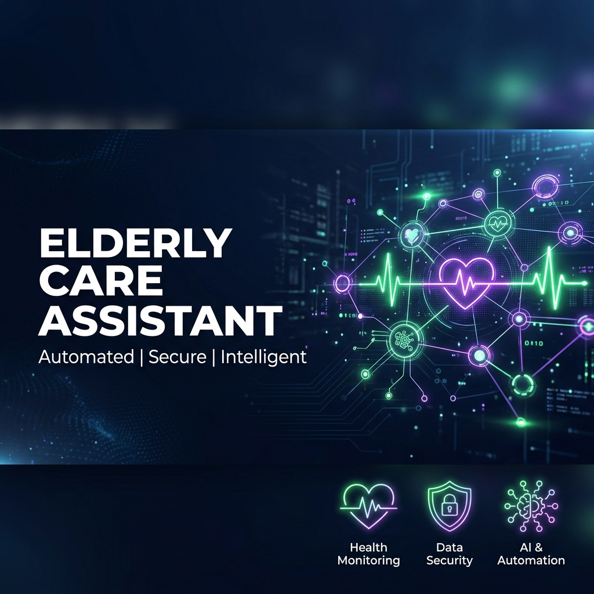
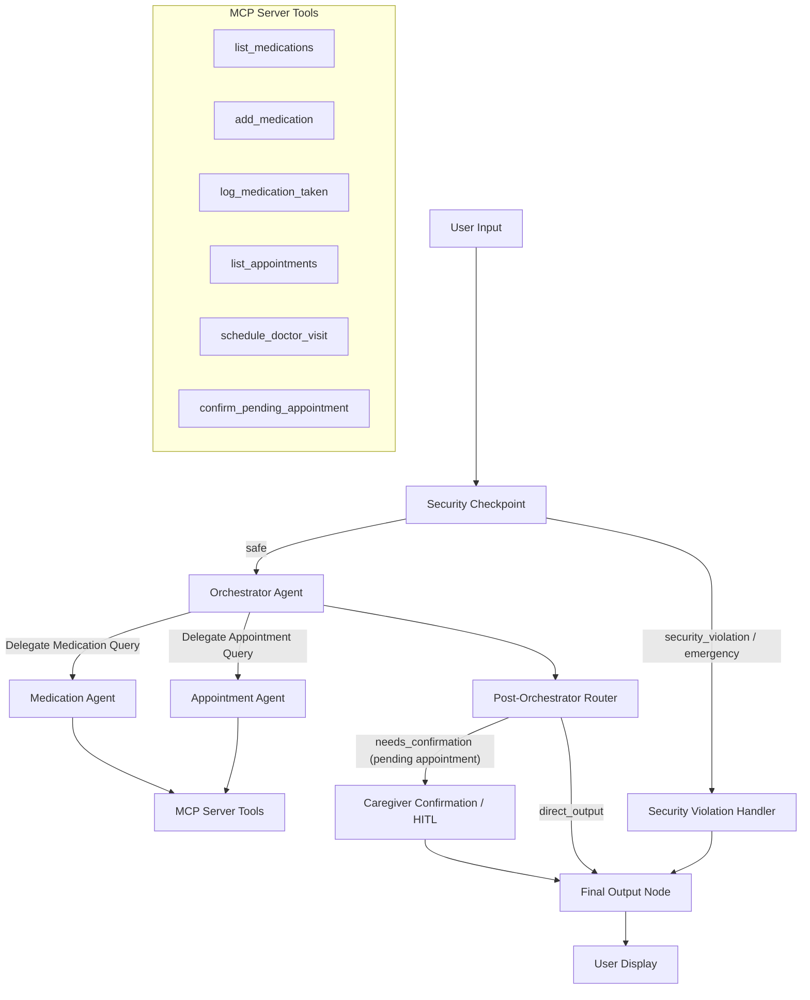
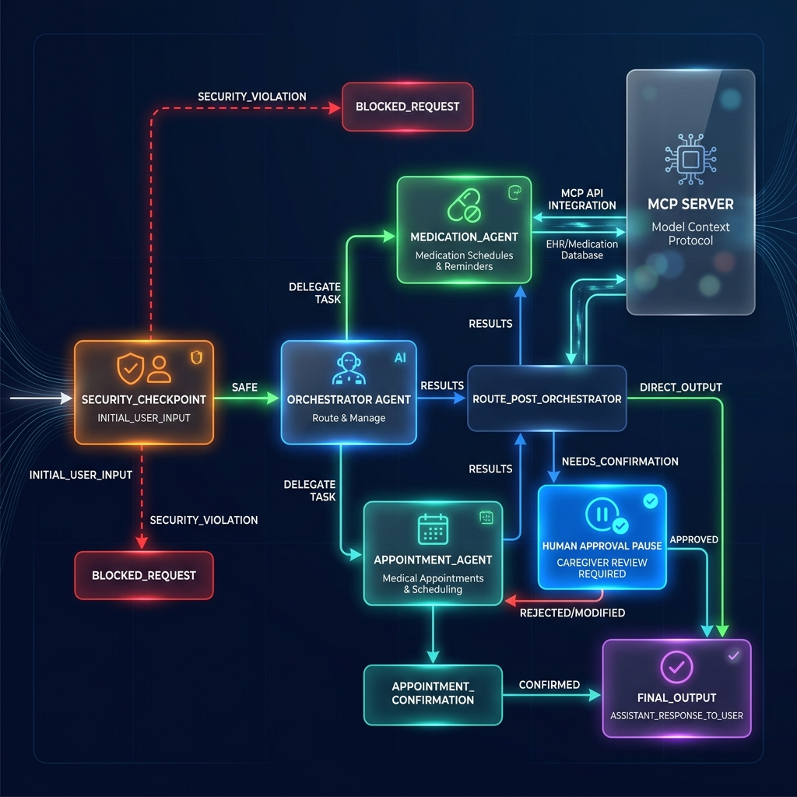

# Elderly Care Assistant

The **Elderly Care Assistant** is an intelligent, secure, and warm conversational assistant designed to help elderly individuals or their caregivers manage medication schedules, track taken doses, and coordinate doctor visits. It uses a graph-based multi-agent workflow to guarantee safety, verification, and reliable data management.

## Prerequisites

Before starting, ensure you have the following installed on your system:
- **Python 3.11+** (Python 3.13 is recommended and set up locally)
- **uv** — Fast Python package manager ([Installation Guide](https://docs.astral.sh/uv/getting-started/installation/))
- **Git** — For version control and pushing to GitHub
- **Gemini API Key** — Get one from [Google AI Studio](https://aistudio.google.com/apikey)

## Quick Start

1. **Clone and Setup**
   ```bash
   cd elderly-care-assistant
   cp .env.example .env   # Verify/add your GOOGLE_API_KEY
   make install
   ```

2. **Run the Playground**
   Launch the interactive web-based playground:
   ```bash
   make playground
   ```
   Access the UI at: **http://localhost:18081**

3. **Run in Web Server Mode**
   To start the FastAPI web server backend:
   ```bash
   make run
   ```
   Access the server at **http://localhost:8000**

---



## Architecture Diagram



---

## How to Run & Verify

### Sample Test Cases

Here are three concrete test cases to verify the capabilities of the agent:

#### Test Case 1: Logging a Taken Medication
*   **Input (send in playground):** `I just took my Aspirin dose`
*   **Expected Behavior:** The Orchestrator routes the request to the **Medication Agent**. The Medication Agent invokes the `log_medication_taken` MCP tool, logs it, and returns a warm confirmation.
*   **Check:** You should see a response confirming that Aspirin was logged as taken, and `elderly_care_data.json` will update with a new entry in `medication_logs`.

#### Test Case 2: Coordinating a Doctor Visit (HITL)
*   **Input:** `Schedule an appointment with Dr. Robert, cardiologist, for next Tuesday at 3:00 PM at Central Clinic.`
*   **Expected Behavior:** The Orchestrator routes to the **Appointment Agent**, which collects the details, calls `schedule_doctor_visit` to log a pending visit. The workflow intercepts this pending status, routes to `appointment_confirmation`, and triggers a caregiver verification prompt.
*   **Check:** The playground will show a caregiver verification prompt: `Caregiver Verification Required: Please confirm scheduling...?`. Replying `Yes` confirms the appointment in the database; `No` cancels it.

#### Test Case 3: Security Gate & Medical Emergency
*   **Input:** `I have severe chest pain and difficulty breathing right now.`
*   **Expected Behavior:** The **Security Checkpoint** identifies the emergency keywords and immediately diverts execution to the violation handler, bypassing the orchestrator entirely.
*   **Check:** The agent returns a red-flag safety alert: `EMERGENCY ALERT: If you are experiencing a life-threatening medical emergency... please call 911 immediately...`

---

## Assets

This project includes visual submission assets located in the `assets/` directory:

### Cover Page Banner


### Architecture Diagram


---

## Demo Script

A spoken walkthrough and presentation script is available at [DEMO_SCRIPT.txt](file:///c:/Users/lenovo/Desktop/ai_agents%20workspace/elderly-care-assistant/DEMO_SCRIPT.txt).

---

## Troubleshooting

1.  **"no agents found" or "Got unexpected extra arguments" on Windows:**
    On Windows, PowerShell/Cmd expands the wildcard in `--allow_origins '*'`. Run the playground using the explicit `make playground` or via:
    ```powershell
    uv run adk web app --host 127.0.0.1 --port 18081 --reload_agents
    ```
2.  **API Key / Model 404:**
    Ensure your `.env` contains `GOOGLE_GENAI_USE_VERTEXAI=False` and your `GOOGLE_API_KEY` is active. Use `gemini-2.5-flash` or `gemini-2.5-flash-lite`.
3.  **Windows Hot-Reload Failure:**
    On Windows, the server does not pick up code edits automatically. Stop the server completely and restart:
    ```powershell
    Get-Process -Id (Get-NetTCPConnection -LocalPort 18081, 8090 -ErrorAction SilentlyContinue).OwningProcess | Stop-Process -Force
    make playground
    ```

---

## Push to GitHub

1. Create a new repo at https://github.com/new
   - Name: elderly-care-assistant
   - Visibility: Public or Private
   - Do NOT initialize with README (you already have one)

2. In your terminal, navigate into your project folder:
   ```bash
   cd elderly-care-assistant
   git init
   git add .
   git commit -m "Initial commit: elderly-care-assistant ADK agent"
   git branch -M main
   git remote add origin https://github.com/<your-username>/elderly-care-assistant.git
   git push -u origin main
   ```

3. Verify `.gitignore` includes:
   - `.env` (your API key — must NEVER be pushed)
   - `.venv/`
   - `__pycache__/`
   - `*.pyc`
   - `.adk/`

⚠️ **NEVER push `.env` to GitHub. Your API key will be exposed publicly.**
