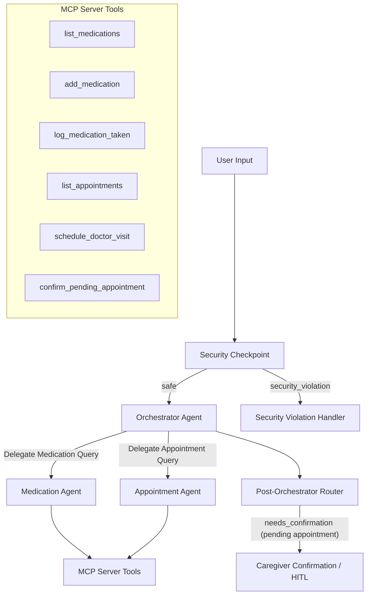

# Submission Writeup — Elderly Care Assistant

## 1. Problem Statement

Elderly individuals frequently manage complex, multi-medication schedules, which increases the risk of missed doses, incorrect dosages, and dangerous drug-drug interactions. Additionally, coordinating numerous doctor appointments, noting doctor specialties, and keeping track of clinic locations poses a heavy cognitive load for senior patients and a coordination challenge for their caregivers. 

The **Elderly Care Assistant** addresses this real-world need by providing a gentle, conversational interface that tracks medication times and schedules, logs completed doses, and schedules doctor visits. Crucially, it incorporates a caregiver validation gate for sensitive coordination events (like doctor appointments) to prevent senior confusion and maintain caregiver supervision.

---

## 2. Solution Architecture

The agent is designed as a graph-based multi-agent system built using the Google Agent Development Kit (ADK) 2.0.

---

## 3. Concepts Used

This project utilizes the core capabilities of the ADK 2.0 toolkit:

*   **ADK Workflow Graph API:** The graph topology, node routing, and state tracking are defined in [app/agent.py](file:///c:/Users/lenovo/Desktop/ai_agents%20workspace/elderly-care-assistant/app/agent.py#L189-L203). It coordinates inputs, security, sub-agent delegation, and human verification.
*   **LlmAgent & Sub-agents:** Defined in [app/agent.py](file:///c:/Users/lenovo/Desktop/ai_agents%20workspace/elderly-care-assistant/app/agent.py#L90-L157). It leverages three specialized agents: `orchestrator`, `medication_agent`, and `appointment_agent`.
*   **AgentTool:** Used by the `orchestrator` to delegate specific requests to specialized sub-agents ([app/agent.py](file:///c:/Users/lenovo/Desktop/ai_agents%20workspace/elderly-care-assistant/app/agent.py#L154)).
*   **MCP Server (Model Context Protocol):** Implemented in [app/mcp_server.py](file:///c:/Users/lenovo/Desktop/ai_agents%20workspace/elderly-care-assistant/app/mcp_server.py). The server runs as a separate process communicating via stdio transport, exposing 6 custom database tools to the sub-agents.
*   **Security Checkpoint Node:** A custom FunctionNode in [app/agent.py](file:///c:/Users/lenovo/Desktop/ai_agents%20workspace/elderly-care-assistant/app/agent.py#L29-L74) that filters prompt injections, redacts PII, and routes emergency events.
*   **Agents CLI:** Project scaffolding and local playground runner capabilities are powered by the CLI.

---

## 4. Security Design

The project enforces robust safety controls specifically tailored for the elderly care domain:
1.  **PII Scrubbing:** Using regular expressions, the `security_checkpoint` node intercepts all inputs and replaces phone numbers and social security/identity numbers with `[REDACTED_PHONE]` and `[REDACTED_ID]` respectively, before passing data to the LLM.
2.  **Prompt Injection Guard:** It detects malicious intent such as system prompts instructions overrides and stops execution, routing the user to a secure alert message.
3.  **Emergency Detection (Domain Control):** If the user mentions life-threatening emergency words (e.g., chest pain, heart attack, heavy bleeding), the node routes directly to an Emergency Violation handler that bypasses the orchestrator and displays a warning to call 911 immediately.
4.  **Audit Logs:** A structured JSON audit log is outputted for every security decision, recording timestamps, severity levels, and decision details.

---

## 5. MCP Server Design

The Model Context Protocol (MCP) server implements the data layer for persistent storage:
*   `list_medications`: Retrieves medications and dosage schedules.
*   `add_medication`: Inserts a new medication regimen.
*   `log_medication_taken`: Logs timestamped doses taken by the user.
*   `list_appointments`: Returns upcoming doctor appointments.
*   `schedule_doctor_visit`: Schedules doctor visits with a status of `Pending`.
*   `confirm_pending_appointment`: Confirms a doctor appointment after caregiver validation.

Data is stored persistently in `elderly_care_data.json` inside the root workspace folder.

---

## 6. Human-in-the-Loop (HITL) Flow

To prevent mistaken appointments and maintain safety, scheduling doctor visits requires explicit caregiver confirmation:
*   When the user requests to schedule a doctor visit, `appointment_agent` creates the record as `Pending`.
*   The `route_post_orchestrator` node detects the pending appointment in the local database and routes the flow to `appointment_confirmation`.
*   The `appointment_confirmation` node pauses execution and yields a `RequestInput` event, presenting a prompt in the playground.
*   Once the caregiver enters `Yes` or `No`, the node is resumed, reads the caregiver's input, and updates the database record status to either `Confirmed` or `Cancelled`.

---

## 7. Demo Walkthrough

### Test Case 1: Logging Taken Medication
*   *Input:* "I just took my Aspirin dose"
*   *Path:* `START` ➔ `security_checkpoint` ➔ `orchestrator` ➔ `medication_agent` (via `AgentTool`) ➔ `log_medication_taken` (MCP tool).
*   *Output:* "Logged that Aspirin was taken just now."

### Test Case 2: Booking Doctor Visit (HITL)
*   *Input:* "Schedule a doctor visit with Dr. Robert next Tuesday at 3 PM at Central Clinic."
*   *Path:* `START` ➔ `security_checkpoint` ➔ `orchestrator` ➔ `appointment_agent` (via `AgentTool`) ➔ `schedule_doctor_visit` (MCP tool) ➔ `route_post_orchestrator` (detects Pending) ➔ `appointment_confirmation` (HITL pause).
*   *Caregiver Choice:* `Yes` ➔ updates status to `Confirmed`.
*   *Output:* "Doctor visit with Dr. Robert on next Tuesday at 3 PM is now CONFIRMED."

### Test Case 3: Emergency Intercept
*   *Input:* "I think I am having a heart attack."
*   *Path:* `START` ➔ `security_checkpoint` (detects emergency keywords) ➔ `security_violation_handler`.
*   *Output:* "EMERGENCY ALERT: If you are experiencing a life-threatening medical emergency... call 911 immediately..."

---

## 8. Impact / Value Statement

The Elderly Care Assistant bridges the gap between seniors and digital health tracking. By providing a warm, simplified voice-compatible text interface, it empowers seniors to manage their health independently. Simultaneously, the caregiver validation gate gives family members peace of mind that medical appointments are supervised and verified, reducing errors and improving care coordination.
